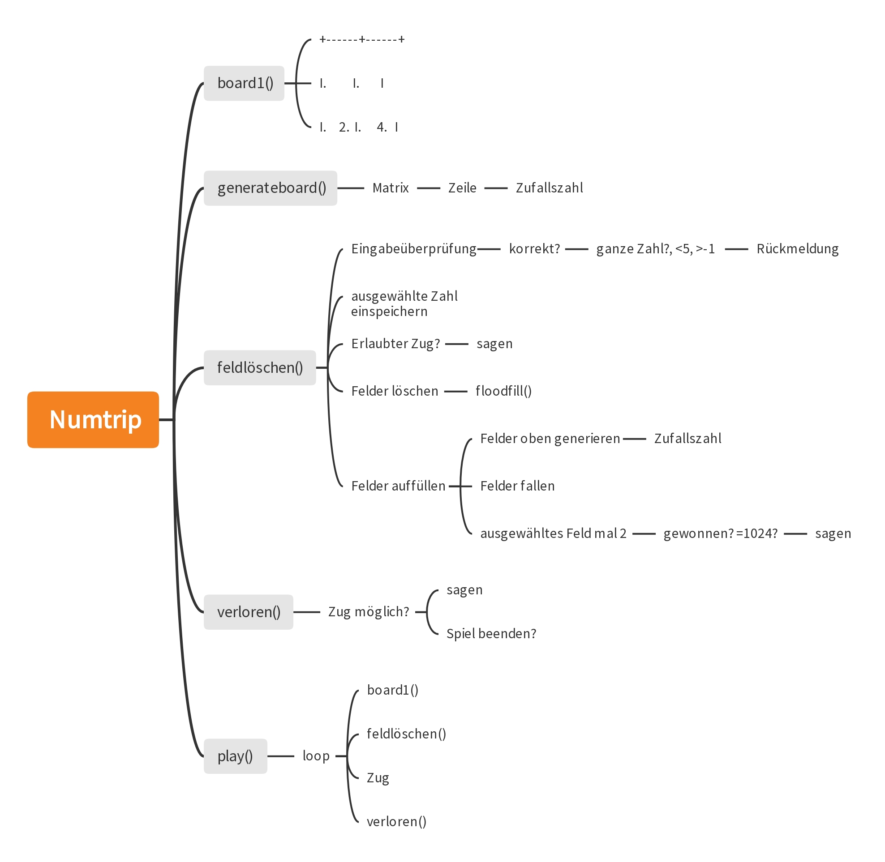

# Log Buch


26. Aug. 
python repetition gemacht. Habe ein paar Sachen übersprungen, bin bis zum Pythagoras-Baum gekommen.


2. sept. 2022
alle listen-aufgaben gemacht. 


8. sept.
Listen gemacht


16. sept.
spielfeld gemacht

21. okt.
hangman angefangen, topdown modell angeschaut

28.okt 
hangman, aufgaben funktionen * viereck, selbsttest

25. Nov. 2022

Ich habe am Numtrip weitergearbeitet. Jetzt kann der spieler Felder löschen und der Input wird überprüft, so dass das Programm nicht crasht, falls er Falsch ist. Dieser Prozess wird auch unendlich lange wiederholt.

```py
def feldlöschen():
    zeile = input('zeile: ')
    spalte = input('spalte: ')
#Welches Feld soll gelöscht werden?
    eingabe_zeile = True
    eingabe_spalte = True
#Variabel ist True falls input korrekt ist

    if not zeile.isnumeric():
        eingabe_zeile = False
    if not spalte.isnumeric():
        eingabe_spalte = False
#wenn eingabe keine ganze zahl ist - falsch
    if zeile.isnumeric():
        zeile = int(zeile)

        if zeile < 0:
            eingabe_zeile = False
        if zeile > 5:
            eingabe_zeile = False

    if spalte.isnumeric():
        spalte = int(spalte)

        if spalte < 0:
            eingabe_spalte = False
        if spalte > 5:
            eingabe_spalte = False
#zahl muss zwischen 1 und 5 sein

    if eingabe_zeile and eingabe_spalte == True:
        board[zeile - 1][spalte - 1] = ' '
#wenn eingabe richtig ist - feld löschen
    else:
        print('Fehlerhafte Eingabe')
# wenn eingabe falsch - mitteilen

```

2. Dez. 2022

Ich habe das Darstellen von einem Feld vereinfacht:

```py
print('I', end='')
for g in range(6 - int(len(str(board[zeile][spalte])))):
    print(' ', end='')
# feld ist 6 zeichen lang. 6 - stellen zahl = anzahl leerzeichen.
print(board[zeile][spalte], end='')
```
und habe das Programm geändert, so dass der Spieler bei einer falschen eingabe eine genaue Rückmeldung bekommt, indem ich eine Variabel 'fehler' brauche. Diese wird je nachdem was der Fehler war geändert und am Schluss geprintet.

```py
def feldlöschen():
    zeile = input('zeile: ')
    spalte = input('spalte: ')

    eingabe_zeile = True
    eingabe_spalte = True

    if not zeile.isnumeric():
        eingabe_zeile = False
        fehler = 'eingabe muss eine zahl sein'
    if not spalte.isnumeric():
        eingabe_spalte = False
        fehler = 'eingabe muss eine (ganze) zahl sein'

    if zeile.isnumeric():
        zeile = int(zeile)

        if zeile < 1:
            eingabe_zeile = False
            fehler = 'zahl muss grösser als 1 sein'
        if zeile > 5:
            eingabe_zeile = False
            fehler = 'zahl muss kleiner als 5 sein'

    if spalte.isnumeric():
        spalte = int(spalte)

        if spalte < 1:
            eingabe_spalte = False
            fehler = 'zahl muss grösser als 1 sein'
        if spalte > 5:
            eingabe_spalte = False
            fehler = 'zahl muss kleiner als 5 sein'

    if eingabe_zeile and eingabe_spalte == True:
        board[zeile - 1][spalte - 1] = ' '
    else:
        print('Fehlerhafte Eingabe')
        print(fehler)
# fehler: sagt was der Spieler falsch gemacht hat
```


6. Dez 2022
Nachbarnzellen der gleichen Zahl werden jetzt auch gelöscht. Das Programm geht überprüft alle Zellen.


<h1>23. Jan 2023 - Finaler Blogbeitrag</h1>


<h2>Ziel des Spiels</h2>
Das ist ein die Zahl 1024 zu erreichen (oder eine andere Zahl, wenn man will), indem man Nachbarfelder mit der gleichen Zahl zusammen kombiniert. Dabei verdoppelt sich der Wert.

<h2>Umsetzung des Spiels</h2>

<h3>Voraussetzungen</h3>
Um das Spiel zu spielen bracht man mindestens Python 3

<h3>Top-Down</h3>



<h3>Erklärung eines algorithmischen Konzepts: Felder auffüllen</h3>
Zuerst müssen Felder, die oberhalb eines ' '-Feldes sind nach unten verschoben werden, damit die leeren Felder alle immer an den obersten Stellen in den Spalten sind. Das simuliert das Fallen der Blöcke. Mit zwei For-Loops werden alle Felder überprüft, ob sie leere Felder unten ihnen haben und wenn ja nach unten verschoben.

```py
for i in range(5):
                for i in range(5):
                    if zeile + 1 < 5:
                        if board[zeile + 1][spalte] == ' ':
                            board[zeile + 1][spalte] = board[zeile][spalte]
                            board[zeile][spalte] = ' '
                        zeile = zeile + 1
                zeile = 0
                spalte = spalte + 1
```

Nach der ersten Verschiebung nach unten können wir schon anfangen neue Felder ins Spiel zu bringen. Es wird überprüft, ob die obersten Felder leer sind und wenn ja mit einer Zufallszahl (1,2 oder4) gefüllt.

```py
# wenn ein Feld oben leer ist, wird es mit einer zufälligen Zahl (1,2 oder 4) gefüllt.
            numbers = [1, 2, 4]
            if board[0][0] == ' ':
                board[0][0] = str(random.choice(numbers))
            if board[0][1] == ' ':
                board[0][1] = str(random.choice(numbers))
            if board[0][2] == ' ':
                board[0][2] = str(random.choice(numbers))
            if board[0][3] == ' ':
                board[0][3] = str(random.choice(numbers))
            if board[0][4] == ' ':
                board[0][4] = str(random.choice(numbers))
```

Diese Vorgänge werden 5-Mal durchgeführt, damit wir sicher sein können, dass alle leeren Felder gefüllt worden sind. Beide Algorithmen sehen zusammen so aus:

```py
# Felder oberhalb eines ' ' Feldes gehen 1 nah unten. Alle Felder werden überprüft
        spalte = 0
        zeile = 0
        for i in range(5):
            for i in range(5):
                for i in range(5):
                    if zeile + 1 < 5:
                        if board[zeile + 1][spalte] == ' ':
                            board[zeile + 1][spalte] = board[zeile][spalte]
                            board[zeile][spalte] = ' '
                        zeile = zeile + 1
                zeile = 0
                spalte = spalte + 1
            spalte = 0

            # wenn ein Feld oben leer ist, wird es mit einer zufälligen Zahl (1,2 oder 4) gefüllt.
            numbers = [1, 2, 4]
            if board[0][0] == ' ':
                board[0][0] = str(random.choice(numbers))
            if board[0][1] == ' ':
                board[0][1] = str(random.choice(numbers))
            if board[0][2] == ' ':
                board[0][2] = str(random.choice(numbers))
            if board[0][3] == ' ':
                board[0][3] = str(random.choice(numbers))
            if board[0][4] == ' ':
                board[0][4] = str(random.choice(numbers))
```

<h2>Grösste Herausforderungen</h2>
Die grösste Herausforderung war das Floodfill zu implementieren, da ich noch nie mit rekursiven Funktionen gearbeitet habe.

<h2>Tipps für andere Schüler</h2>
Ich hätte ganz am Anfang eine Funktion gemacht, dass kontroliert, ob ein Feld existiert, so dass ich nicht jedes Mal das neu bei einer funktion schreiben muss. Das hätte mir sehr viel Zeit gespart.


17. märz 2023

Folgende Sachen haben wir in der letzen Woche gemacht:

Node RED
Node-RED ist ein Tool zur visuellen Programmierung von Flows. Es bietet eine grafische Oberfläche
zum Verbinden von Nodes das sind die kleinen kästchen die auf Abbildung 1 zu sehen sind, um
Daten zu verarbeiten und automatsierte Abläufe zu erstellen. Es bietet die Möglichkeit, messgeräte
u.a miteinander zu verknüpfen und zu automatsieren und wie in userem fall später dann daten zu
sammeln. Node-RED kann Kombinaton mit verschiedenen Platformen wie Arduinos und Raspberry
Pi wie zum beispiel unser kleines CO2 messgerät verwendet werden.

Postman
Postman ist eine Softwareanwendung zur Erstellung, Verwaltung und Testung von APIs. Es bietet eine
benutzerfreundliche Oberfläche zum Senden von HTTP-Anfragen an eine API und zum Anzeigen der
Antwort. Es ermöglicht Entwicklern, schnell API-Endpoints zu testen und zu debuggen, indem sie
Anfragen und Antworten in einer visuellen Umgebung anzeigen.

Auf dem Programm Postman kann man dann unsere API verwenden, indem man einen GET-Request
erstellt und den zu konvertierenden Text übergibt. Die API wandelt dann den Text in Emojis um und
gibt das Ergebnis zurück. Das ist eine einfache Möglichkeit, um zu testen, ob die API wie erwartet
funktoniert. Man kann den Request-URL in Postman eingeben und den gewünschten Text
übergeben. Wenn alles funktoniert, sollte man die Emojis als Antwort erhalten.

23. März
Authenzifizierung eines Benutzers:
Wir haben in Node-RED einen Flow gemacht, der zwei HTML-Seiten enthält: eine _welcome.html_ und eine _login.html_. Aufbau: Die Login-Funktion sucht in der Datenbank nach Benutzernamen und Passwort und überprüft, ob sie übereinstimmen. Dies wird in den Cookies gespeichert.

Datenbank:
```py
flow.set(
    "johnny",
    {
        pw: "qwert"
    }
)
flow.set(
    "maria",
    {
        pw: "asdf"
    } )
return msg;
```

Cookies:
```py
if (user){
    if (password== user.pw){
        msg.cookies = {
            auth: true,
            name: name
        }
    }
} 
```
Die Login Funktion leitet uns and die entscprechende seite weiter: _welcome.html_.

Das Problem ist, dass man ein Passwort niemals abspeichern darf. Man muss sie immer gehasht abspeichern, da sonst bei einem Datenleak alle Benutzernamen und Passwörter veröffentlicht werden könnten.

https://node-red-ol18.onrender.com/#flow/ed73c51f6c96ba27


